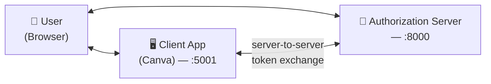
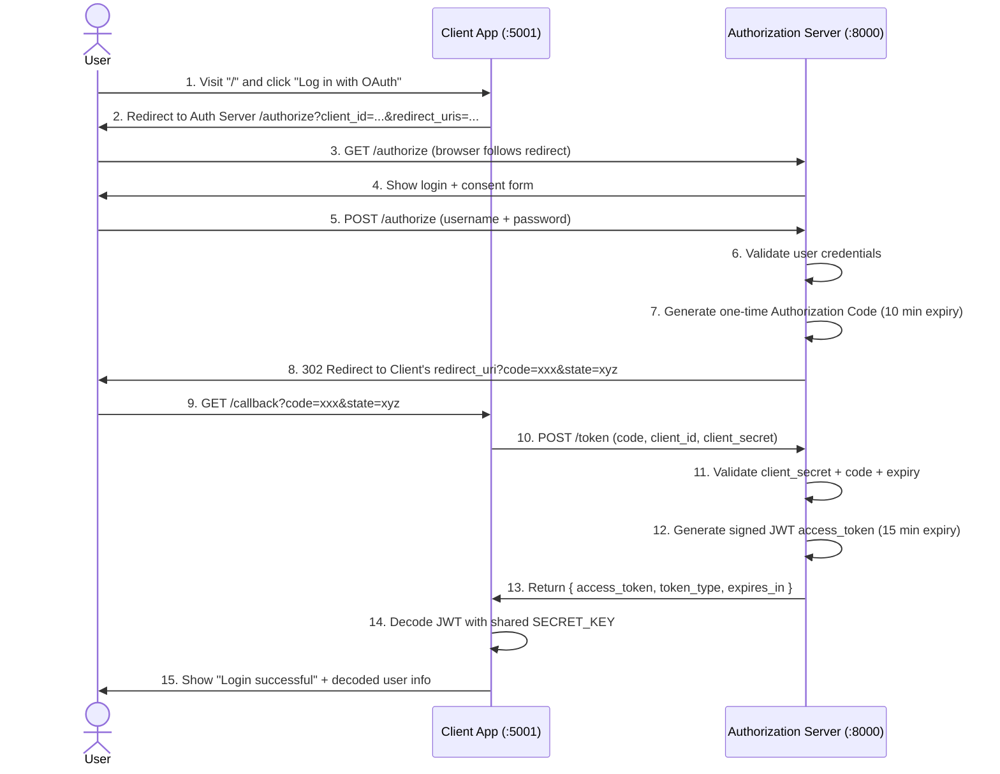

# OpenAuth 2.0 (openautg2.0)

A minimal, from-scratch implementation of the **OAuth 2.0 Authorization Code Flow**, built with FastAPI. It simulates two real-world roles — an **Authorization Server** (like Google/GitHub login) and a **Client App** (like a third-party app such as Canva) — so you can see exactly what happens under the hood when you click "Log in with Google."

No external OAuth libraries are used on the server side — the goal is to learn the protocol, not hide it behind a framework.

---

## Table of Contents

- [Why this exists](#why-this-exists)
- [How OAuth 2.0 Works (the short version)](#how-oauth-20-works-the-short-version)
- [Architecture](#architecture)
- [Full Authorization Code Flow](#full-authorization-code-flow)
- [Project Structure](#project-structure)
- [Setup](#setup)
- [Running the Demo](#running-the-demo)
- [Endpoint Reference](#endpoint-reference)
- [How to Register Your Own Client](#how-to-register-your-own-client)
- [Security Notes](#security-notes)
- [Roadmap Ideas](#roadmap-ideas)
- [License](#license)

---

## Why this exists

Most tutorials show you how to *use* `Authlib` or `authlib`/`python-social-auth` to bolt OAuth onto an app in five minutes. This project does the opposite: it implements the protocol manually so every redirect, every token, and every check is visible and hackable. It's meant as a **learning/reference implementation**, not a production-ready auth server.

---

## How OAuth 2.0 Works (the short version)

OAuth 2.0 solves one problem: how can a **Client App** (e.g. Canva) get limited access to your account on another service (e.g. Google) **without you ever giving Canva your Google password**?

The answer is a middleman — the **Authorization Server** — that:
1. Verifies your identity directly (you type your password only on the Auth Server's page, never the Client App's).
2. Asks if you consent to let the Client App access your account.
3. Hands the Client App a temporary, revocable **token** instead of your credentials.

This project implements the most common variant: the **Authorization Code Flow**.

---

## Architecture

This repo has two independent FastAPI apps that talk to each other over HTTP:

| Role | File | Port (suggested) | Real-world analogy |
|---|---|---|---|
| **Authorization Server** | `server.py` | `8000` | Google / GitHub / Facebook login |
| **Client App** | `client.py` | `5001` | Canva, Spotify, or any third-party app |



---

## Full Authorization Code Flow

This sequence diagram matches exactly what the code does, step by step:



**Why the code exchange happens twice (steps 3–8 then 9–13)?**
This is the key security idea of the Authorization Code flow: the **code** only ever travels through the user's browser (which is semi-trusted), while the **client_secret** and the final **access_token exchange** happen server-to-server (step 10), where it can't be intercepted by anything running in the browser.

---

## Project Structure

```
openautg2.0/
├── server.py          # Authorization Server — issues codes & JWT tokens
├── client.py          # Example Client App ("Canva") — consumes the OAuth flow
├── requirements.txt   # (create this — see Setup)
└── README.md
```

---

## Setup

### 1. Requirements

- Python 3.9+
- `pip`

### 2. Install dependencies

```bash
pip install fastapi uvicorn httpx pyjwt python-multipart
```

> `python-multipart` is required because `server.py` and `client.py` use `Form(...)` fields.

Optionally freeze these into a `requirements.txt`:

```bash
pip freeze > requirements.txt
```

---

## Running the Demo

You need **two terminals** — one per app.

**Terminal 1 — start the Authorization Server (port 8000):**
```bash
uvicorn server:app --reload --port 8000
```

**Terminal 2 — start the Client App (port 5001):**
```bash
uvicorn client:app --reload --port 5001
```

Then open your browser to:

```
http://localhost:5001
```

1. Click **"Log in with OAuth Server"**.
2. You'll land on the Authorization Server's login page. Use one of the seeded test accounts:

   | Username | Password |
   |---|---|
   | `alice` | `password123` |
   | `bob` | `securepassword456` |

3. Submit the form — you'll be redirected back to the Client App with a decoded JWT showing your identity and the granted `client_id`.

---

## Endpoint Reference

### Authorization Server (`server.py`)

| Method | Path | Purpose |
|---|---|---|
| `GET` | `/authorize` | Validates `client_id` + `redirect_uris`, shows the login/consent form |
| `POST` | `/authorize` | Validates user credentials, issues a one-time **authorization code**, redirects back to the client |
| `POST` | `/token` | Exchanges a valid authorization code (+ client credentials) for a signed **JWT access token** |

### Client App (`client.py`)

| Method | Path | Purpose |
|---|---|---|
| `GET` | `/` | Shows the "Login with OAuth" button, builds the `/authorize` URL |
| `GET` | `/callback` | Receives the `code`, exchanges it server-to-server via `POST /token`, decodes and displays the JWT |

---

## How to Register Your Own Client

To let a new app plug into your Authorization Server, add an entry to `REGISTERED_CLIENTS` in `server.py`:

```python
REGISTERED_CLIENTS = {
    "your_app_client_id": {
        "client_name": "Your App Name",
        "client_secret": "a-long-random-secret",
        "redirect_uris": [
            "http://localhost:5003/callback"
        ]
    }
}
```

Then in your client app, set matching `CLIENT_ID`, `CLIENT_SECRET`, and `REDIRECT_URI` values, and follow the same two calls the sample `client.py` makes: redirect to `/authorize`, then `POST /token` from your backend once you receive the `code`.

---

## Security Notes

This project is a **teaching tool**. Before using any of this pattern in a real product, fix the following (all are intentional simplifications, not oversights, in the current demo):

- **Hardcoded secrets** — `SECRET_KEY` and every `client_secret` are hardcoded in source. In production, load these from environment variables or a secrets manager, and never commit them to git.
- **Plaintext passwords** — `USERS` stores passwords in plain text. Use a hashing algorithm like `bcrypt` or `argon2`, and never store or compare raw passwords.
- **In-memory storage** — `USERS`, `REGISTERED_CLIENTS`, and `AUTHORIZATION_CODES` are plain Python dicts that reset on every restart and aren't safe for concurrent/multi-worker deployments. Swap in a real database (Postgres, Redis for short-lived codes, etc.).
- **No PKCE** — Modern OAuth (especially for public/mobile/SPA clients) should add [PKCE](https://oauth.net/2/pkce/) on top of the Authorization Code flow to protect against code interception, even for confidential clients it's now recommended by the OAuth 2.1 draft.
- **No HTTPS** — the demo runs on plain `http://localhost`. Real deployments must use HTTPS everywhere; OAuth tokens sent over HTTP can be intercepted.
- **`state` parameter isn't verified** — the client should check that the `state` it gets back on `/callback` matches the one it originally sent, to prevent CSRF attacks. This demo passes it through but doesn't validate it.
- **No token revocation / refresh tokens** — access tokens simply expire after 15 minutes with no way to renew them without a full re-login. A production system would add refresh tokens.

---

## Roadmap Ideas

- [ ] Add PKCE support
- [ ] Add refresh tokens
- [ ] Move users/clients into a real database
- [ ] Add scopes (e.g. `read:profile`, `write:files`) instead of all-or-nothing access
- [ ] Verify `state` on the client to prevent CSRF
- [ ] Dockerize both services with a `docker-compose.yml` for one-command startup

---

## License

MIT — do whatever you want with this, just don't ship the hardcoded secrets to production 🙂
